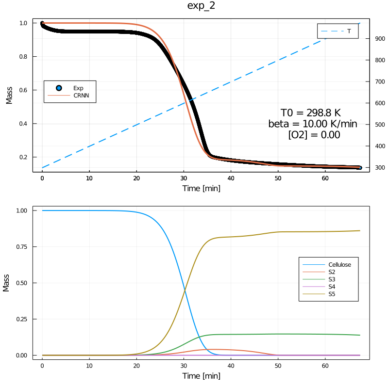
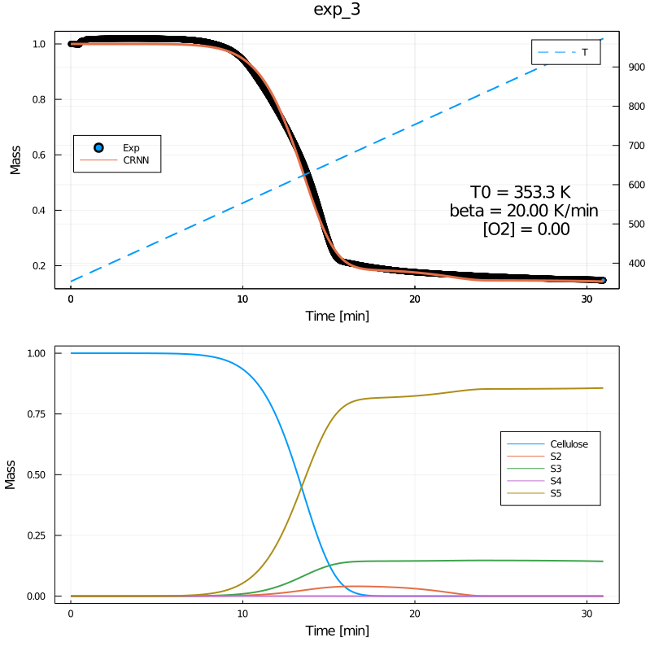

# Motivation

# Methodology

# Results

For now, we propose a five species and 10 reactions model, and the number of species and reactions are hyper-parameters.

> I only condier the experimental data during heating up, as I cannot determine the time during cooling down.

**3 out of 4 datasets for training.**

**1 out of 4 datasets for validation.**

**Quick observations**

+ The model works well for both training and validation datasets
+ The changes at the begining of experiments are likely due to non-pyrolysis process as the temperature are very low at the beginning.